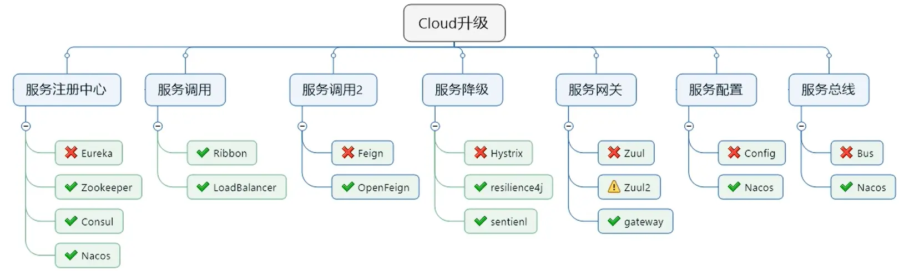
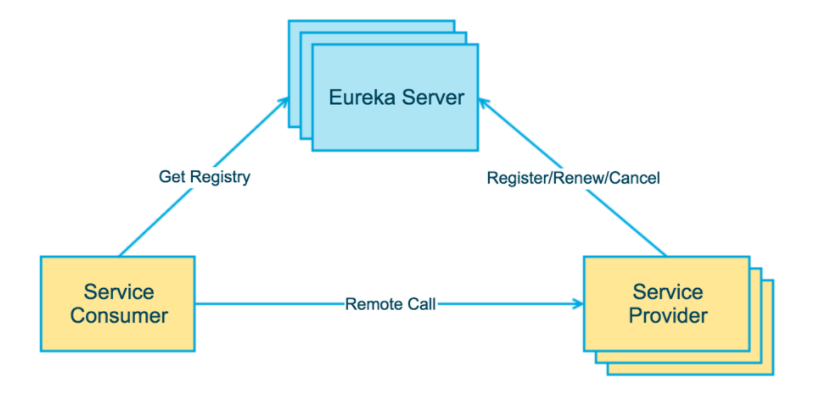
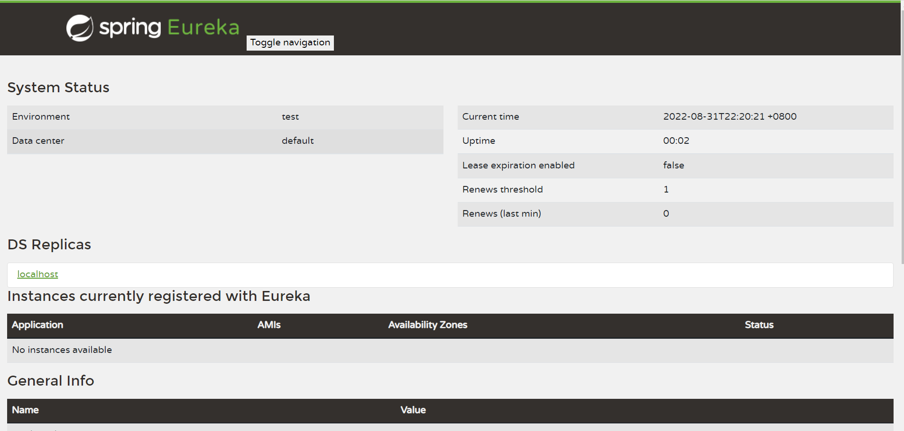
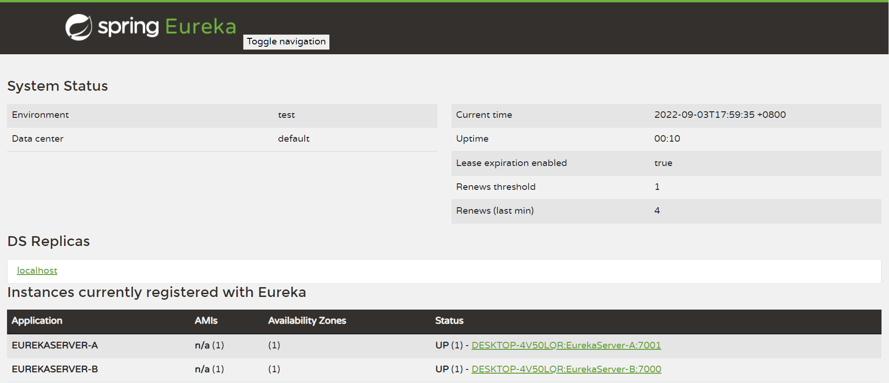
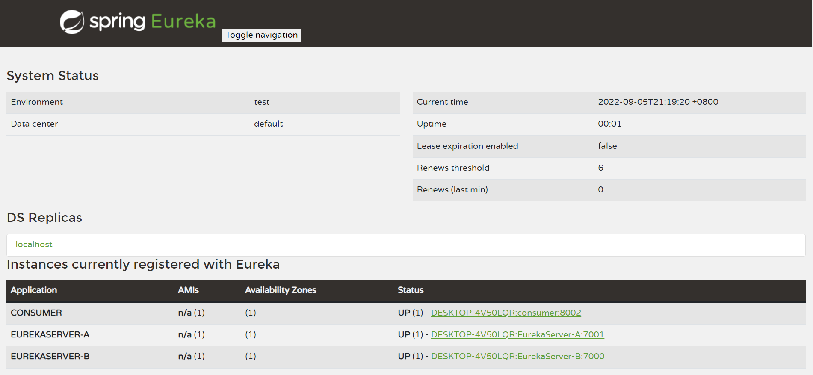
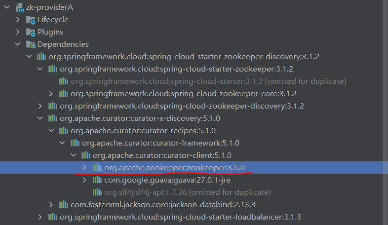
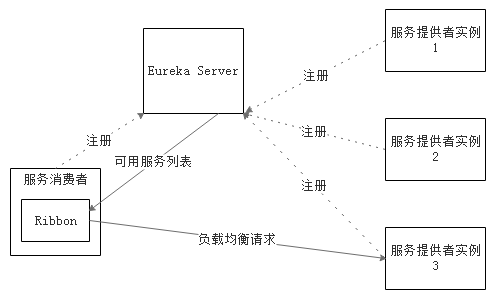
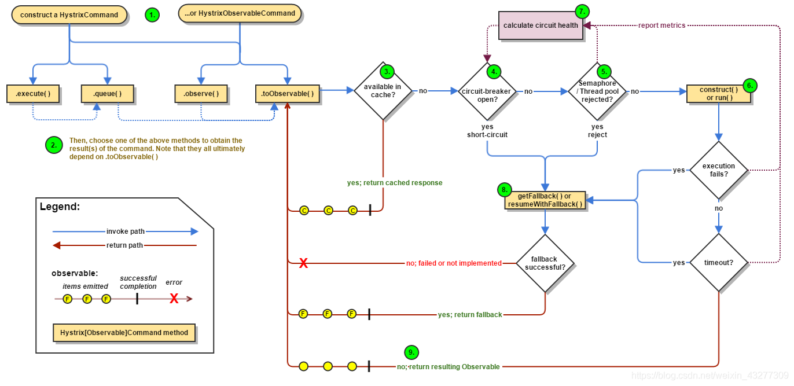
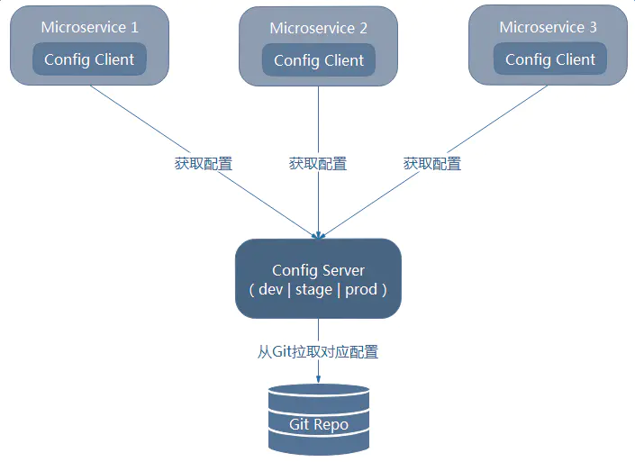

# SpringCloud介绍

## 微服务架构涉及的技术

1. 服务调用
2. 服务降级
3. 服务注册与发现
4. 服务熔断
5. 负载均衡
6. 消息队列
7. 网关
8. 配置中心
9. 服务监控
10. 全链追踪
11. 服务总线


## SpringCloud组件停更及替换



# 注册中心-Eureka

## Eureka介绍

Eureka采用C-S架构，分为Eureka-server和Eureka-client，并且Eureka-client包含服务提供者和服务消费者两种角色。

* Eureka-client：应用启动后会将信息注册到server。每个一段时间（默认30秒）向server发送发送心跳，证明当前服务可用。
* Eureka-server：提供服务注册服务，各节点启动后会在server注册，server存储所有可用服务节点信息。90秒没收到节点心跳，将节点移除



## 配置文件

```yaml
eureka:
	instance:
		hostname: #主机名，默认为操作系统主机名
		instance-id: #唯一实例ID，不能与其他服务重复
		prefer-ip-address: #是否显示ip地址，为true时，hostname失效
	client: 
	server:
	dashboard:
```

* instance:当前Eureka Instance实例信息配置
* client：客户端信息配置
* server：注册中心信息配置
* dashboard：注册中心仪表盘配置

参考：https://www.cnblogs.com/jpfss/p/11308300.html

## 案例

### Eureka-Server

1. 添加依赖

```xml
<parent>
    <groupId>org.springframework.boot</groupId>
    <artifactId>spring-boot-starter-parent</artifactId>
    <version>2.7.3</version>
    <relativePath/> <!-- lookup parent from repository -->
</parent>
<dependencies>
	<dependency>
		<groupId>org.springframework.cloud</groupId>
		<artifactId>spring-cloud-starter</artifactId>
        <!--3.1.3-->
	</dependency>
    <dependency>
        <groupId>org.springframework.cloud</groupId>
        <artifactId>spring-cloud-starter-netflix-eureka-server</artifactId>
        <!--3.1.3-->
    </dependency>
</dependencies>
```


2. 启动代码添加@EnableEurekaServer注解

```java
@SpringBootApplication
@EnableEurekaServer
public class EurekaServerApplication {
    public static void main(String [] args){
        SpringApplication.run(EurekaServerApplication.class,args);
    }
}
```


3.配置文件

```yaml
server:
  port: 7000

spring:
  application:
    name: EurekaServer

eureka:
  client:
    #注册中心不需要自己注册自己
    #默认true
    register-with-eureka: false
    fetch-registry: false
    service-url:
      defaultZone: http://localhost:${server.port}/eureka/
```

* eureka.client.register-with-eureka: 是否将自己注册到EurekaServer，默认true
* eureka.client.fetch-registry：是否从注册中心拉取注册信息表，默认true
* eureka.client.service-url.defaultZone: EurekaServer的地址，多个用逗号（，）分隔
* spring.application.name的内容会成为该服务的名字注册到EurekaServer


4. 启动后界面

启动后访问http://localhost:7000/



### 集群

单点注册中心若遇到故障，对整个系统而言是毁灭性的，所以为维持其可用行，集群是很好的解决方案。Eureka通过相互注册来实现高可用的部署。

多注册中心配置步骤同上，需要改动的地方在于配置文件：

1. A-Server的配置文件，service-url需指向B-Server：

```yaml
server:
  port: 7001

spring:
  application:
    name: EurekaServer-A

eureka:
  client:
    register-with-eureka: true
    fetch-registry: true
    service-url:
      defaultZone: http://localhost:7000/eureka/
```

2. B-Server的配置文件，service-url需指向A-Server：

```yaml
server:
  port: 7000

spring:
  application:
    name: EurekaServer-B

eureka:
  client:
    register-with-eureka: true
    fetch-registry: true
    service-url:
      defaultZone: http://localhost:7001/eureka/
```



### Eureka-Client

1. 引入依赖

```xml
<dependency>
	<groupId>org.springframework.cloud</groupId>
	<artifactId>spring-cloud-starter-netflix-eureka-client</artifactId>
</dependency>
```

2. 启动代码添加@EnableEurekaClient注解

```java
@SpringBootApplication
@EnableEurekaClient
public class EurekaProviderApplication {
    public static void main(String[] args) {
        SpringApplication.run(EurekaProviderApplication.class, args);
    }
}
```

3. 配置文件

```yaml
spring:
  application:
    name: provider
eureka:
  client:
    register-with-eureka: true
    fetch-registry: true
    service-url:
      defaultZone: http://localhost:7000/eureka/,http://localhost:7001/eureka/
```

4. 启动后



### 获取注册服务信息表

获取注册中心的注册服务列表

1. 启动代码添加@EnableDiscoveryClient

```java
@SpringBootApplication
@EnableEurekaClient
@EnableDiscoveryClient
public class EurekaProviderBApplication {
    public static void main(String[] args){
        SpringApplication.run(EurekaProviderBApplication.class,args);
    }
}
```

2. 获取注册服务信息表

```java
@Resource
private DiscoveryClient discoveryClient;

```

## 自我保护模式

当Eureka服务器每分钟收到的心跳数量低于一个阈值时，会触发自我保护模式，不会将服务注册表中的服务实例信息删除。当收到的心跳重新恢复到阈值时，才自动退出自我保护模式。

计算公式：服务实例总数量×（60/每个实例心跳间隔秒数）×自我保护系数（0.85）


# 注册中心-zookeeper

可通过https://downloads.apache.org/zookeeper/ 下载zookeeper，然后安装到服务器上。

## 案例

1. 引入依赖

```xml
<dependency>
	<groupId>org.springframework.cloud</groupId>
	<artifactId>spring-cloud-starter-zookeeper-discovery</artifactId>
</dependency>
```



该依赖的版本需与安装的zookeeper版本一致

若版本不一致，可以将该依赖排除，然后引入对应版本的zookeeper依赖

```xml
<dependency>
    <groupId>org.springframework.cloud</groupId>
    <artifactId>spring-cloud-starter-zookeeper-discovery</artifactId>
    <exclusions>
        <exclusion>
            <groupId>org.apache.zookeeper</groupId>
            <artifactId>zookeeper</artifactId>
        </exclusion>
    </exclusions>
</dependency>
<dependency>
    <groupId>org.apache.zookeeper</groupId>
    <artifactId>zookeeper</artifactId>
    <version>xx.xx.xx</version>
</dependency>
```


2. 启动类注解

```java
@SpringBootApplication
@EnableDiscoveryClient
public class ZKProvider_A_Application
{
    public static void main( String[] args )
    {
        SpringApplication.run(ZKProvider_A_Application.class,args);
    }
}
```

3. 配置文件

```yaml
server:
  port: 8004

spring:
  application:
    name: ZK-provider-A
  cloud:
    zookeeper:
      connect-string: #zk的IP地址
```

## ZK节点

### 节点类型

* 持久性节点：节点创建后一只存在于注册中心，客户端断连/注册中心重启，节点还存在。可以创建子节点，子节点可以临时也可以永久。不可同名
* 临时性节点：客户端失去与Server的连接后，Server会立刻将该节点删除。不能创建子节点，不能同名
* 顺序性节点
  * 持久顺序节点：同名节点会在后面添加序号，其余与持久节点一致
  * 临时顺序节点：同名节点会在后面添加序号，其余与临时节点一致

# 注册中心-consul

## 介绍

HashiGorp公司用go语言开发的一套开源的分布式服务发现和配置管理系统。

提供服务治理、配置中心、控制总线等功能，且每个功能可以单独使用。

下载地址：https://www.consul.io/downloads

## 案例

1. 引入依赖

```xml
<dependency>
    <groupId>org.springframework.cloud</groupId>
    <artifactId>spring-cloud-starter-consul-discovery</artifactId>
</dependency>
```

2. 配置文件

```yaml
server:
  port: 8005

spring:
  application:
    name: Consul-provider-A

  cloud:
    consul:
      host: #consul server host
      port: #consul server port
      discovery:
        service-name: ${spring.application.name}
```

3. 启动类

```java
@SpringBootApplication
@EnableDiscoveryClient
public class ConsulProvider_A_Application {
    public static void main(String[] args){
        SpringApplication.run(ConsulProvider_A_Application.class,args);
    }
}
```

使用到的启动类注解与ZK的注解一致

# Ribbon

## 负载均衡

将访问服务的请求，均衡的分配到每个服务上，避免服务因请求压力过大而崩溃。

负载均衡分为两种：

* 集中式LB()--在服务消费者和服务提供者之间有一个独立的负载均衡系统来承担负载均衡功能
* 进程式LB--将负载均衡功能整合进服务消费端，会从注册中心拉取注册信息表，并缓存到本地。

Ribbon是一个软负载均衡的客户端组件，可以和其他所需请求的客户端结合使用。



Ribbon工作时先从Eureka Server(注册中心)获取服务信息列表，优先选择同一个区域内负载较少的Server；然后根据用户指定的策略，将请求发送给服务提供者。

## Ribbon核心组件IRule及负载均衡策略

IRule接口：根据特定的算法从服务列表中选择一个要访问的服务

|                 实现类                  |                         负载均衡算法                         |
| :-------------------------------------: | :----------------------------------------------------------: |
| com.netflix.loadbalancer.RoundRobinRule |                             轮询                             |
|   com.netflix.loadbalancer.RandomRule   |                             随机                             |
|   com.netflix.loadbalancer.RetryRule    | 先按照RoundRobinRule的策略获取服务，如果获取失败则在指定时间内进行重试，获取可用的服务 |
|        WeightedResponseTimeRule         | 对RoundRobinRule的扩展，响应速度越快的实例选择权重越大，越容易被选中 |
|            BestAvailableRule            | 会先过滤掉由于多次访问故障而处于断路跳闸状态的服务，然后选择一个并发量小的服务 |
|        AvailabilityFilteringRule        |          先过滤掉故障实例，然后再选择并发量小的实例          |
|            ZoneAvoidanceRule            | 默认规则，复合判断server所在区域的性能和server的可用性选择服务器 |

Ribbon默认负载轮询算法：

接口第几次请求数%请求服务的集群数量=实际调用服务的位置下标

# openFeign

## 介绍

openFeign是Spring Cloud对feign的再次封装，使其支持MVC注解和HttpMessageConverts。Spring Cloud 集成了 Eureka、Spring Cloud CircuitBreaker 以及 Spring Cloud LoadBalancer，在使用 Feign 时提供负载均衡的 http 客户端

Feign是声明式Web Service客户端，简化了使用RestTemplate调用服务的步骤，通过接口+注解的方式来调用服务。

## 案例

1.引入依赖

```xml
<dependency>
    <groupId>org.springframework.cloud</groupId>
    <artifactId>spring-cloud-starter-openfeign</artifactId>
</dependency>
```

2.添加启动类注解

```java
@SpringBootApplication
@EnableEurekaClient
@EnableFeignClients
public class OpenFeignApplication {
    public static void main(String[] args){
        SpringApplication.run(OpenFeignApplication.class,args);
    }
}
```

2.创建接口

```java
@Component
@FeignClient(value = "provider")
public interface TestService {
    @GetMapping("/hello/port")
    String getHello();
}
```

@FeignClient的value属性对应服务提供者的application.name

## 进阶


# Hystrix

由于网络或者自身原因，微服务不能保证服务百分百可用。若单个服务出现问题，那调用该服务时会出现延迟甚至调用失败的情况。同时，不断地调用该服务会增加服务器地负担，当负担过重，会导致服务崩溃。

开发者很难避免因某些因素而导致的服务之间依赖调用失败，但是尽可能在调用失败时减少或避免对调用方带来的影响

## 介绍

Hystrix是根据断路器模式而建造的。当某个服务发生故障后，通过断路器的故障监控，向调用方返回一个符合预期的服务降级处理，而不是长时间等待或返回调用方无法处理的异常，避免调用方线程不会被长时间不必要的占用。



对于服务器容错来说就是保护服务消费者。

* 服务降级：当服务不可用或者出现问题时设置一个备选方案，避免长时间等待
* 服务熔断：达到设置的最大服务访问量时，拒绝请求，然后调用服务降级方法返回友好提示
* 服务限流：达到最大服务请求时，拒绝请求。

## 案例

1. 引入依赖

```xml
<dependency>
    <groupId>org.springframework.cloud</groupId>
    <artifactId>spring-cloud-starter-netflix-eureka-client</artifactId>
</dependency>
<dependency>
    <groupId>org.springframework.cloud</groupId>
    <artifactId>spring-cloud-starter-netflix-hystrix</artifactId>
    <version>2.2.10.RELEASE</version>
</dependency>
```

2. 启动类注解

```java
@SpringBootApplication
@EnableEurekaClient
@EnableHystrix
public class ProviderHystrixApplication {
    public static void main(String[] args) {
        SpringApplication.run(ProviderHystrixApplication.class, args);
    }
}
```

@EnableCircuitBreaker已被弃用，可使用@EnableHystrix开启Hystrix

3. 使用@HystrixCommand

```java
@HystrixCommand(
    fallbackMethod = "fallbackMethod",
)
public String useProvider_TimeOut() {
    try {
        TimeUnit.MILLISECONDS.sleep(3000);
    } catch (InterruptedException e) {
        e.printStackTrace();
    }
    return "线程池:  " + Thread.currentThread().getName() + " service time out ";
}

public String fallbackMethod() {
    return "系统繁忙或者运行报错，请稍后再试";
}
```

fallbackMethod参数对应的是服务降级方法的方法名，服务降级方法需与被@HystrixCommand标记的方法有同样的入参。

### 服务熔断

```java
@HystrixCommand(
    fallbackMethod = "breakMethod",
    commandProperties = {
        @HystrixProperty(name = "circuitBreaker.enabled", value = "true"),
        @HystrixProperty(name = "circuitBreaker.requestVolumeThreshold", value = "20"),
        @HystrixProperty(name = "circuitBreaker.sleepWindowInMilliseconds", value = "10000"),
        @HystrixProperty(name = "circuitBreaker.errorThresholdPercentage", value = "60")
    }
)
```

* circuitBreaker.enabled：开启断路器
* circuitBreaker.requestVolumeThreshold： 在最近的时间窗口内，请求数量需达到阈值才会开启断路器。默认为20，10秒内该请求数量需达到20次。
* circuitBreaker.sleepWindowInMilliseconds：时间窗口，默认是最近10秒。
* circuitBreaker.errorThresholdPercentage：错误百分比阈值。默认是50%，当请求总数超过阈值，且有50%的请求出现异常，就会开启断路器
* execution.isolation.thread.timeoutInMilliseconds：请求超时时间

断路器开启或关闭条件：

* 条件1：请求数量达到阈值（默认10秒20个请求）
* 条件2：失败率达到设置的百分比时（默认10秒50%请求失败）
* 两个条件都满足则会打开断路器
* 断路器开启后不会call服务提供方的方法，而是直接调用服务降级方法
* 一段时间后（默认5秒），断路器进入半开状态，会让其中一个请求call到服务提供者。若成功，断路器关闭；失败，继续开启。

### 全局服务降级

```java
@DefaultProperties(defaultFallback = "")
```

使用该注解在controller上，该controller中被@HystrixCommand标记的方法会默认设置defaultFallback参数指向的服务降级方法，若@HystrixCommand注解上设置了fallbackMethod参数，则会优先调用fallbackMethod指向的服务降级函数


# 服务网关-GateWay

基于Spring5构建，能够实现响应式非阻塞式的Api，支持长连接，能够更好的整合Spring体系的产品，依赖SpringBoot-WebFlux，WebFlux框架底层则使用了高性能的Reactor模式通信框架Netty


## 三大核心概念

### 路由（Route）

是构建网关的基本模块，是由ID，目标URL，一系列的断言和过滤器组成，如果断言为true，则匹配该路由

### 断言（Predicate）

开发人员可以匹配HTTP请求中的所有内容，如果请求与断言相匹配则进行路由。

假设转发uri为localhost：8888，gateway服务器uri为localhost:9002

| 规则    | 实例                                                         | 说明                                                         |
| ------- | ------------------------------------------------------------ | ------------------------------------------------------------ |
| Path    | - Path=/gate/，/rule/                                        | 当请求路径为gate、rule开头时，转发到localhost：8888服务器上  |
| Before  | \- Before=2017-01-20T17:42:47.789-07:00[America/Denver]      | 在某个时间（2017-01-20T17:42:47.789-07:00）之前的请求才会被转发到 |
| After   | \- After=2017-01-20T17:42:47.789-07:00[America/Denver]       | 在某个时间之后的请求才会被转发                               |
| Between | \- Between=2017-01-20T17:42:47.789-07:00[America/Denver],2017-01-21T17:42:47.789-07:00[America/Denver] | 在某个时间段之间的才会被转发                                 |
| Cookie  | \- Cookie=username,zzyy                                      | 匹配cookie。cookie中必须有username=zzyy才能访问。其中cookie的值支持正则 |
| Header  | \- Header=X-Request-Id, \d+                                  | 请求头，和cookie用法类似                                     |
| Host    | \- Host=www.hd123.com                                        | 根据host地址匹配                                             |
| Method  | \- Method=GET                                                | 只有GET方法才会匹配转发请求                                  |
| Query   | -Query=token                                                 | 根据参数匹配，请求中需有token参数                            |


### 过滤器(Filter)

指的是spring框架中GatewayFileter的实例，使用过滤器，可以在**请求被路由前或者之后**对请求进行修改.

假设转发uri为localhost：8888，gateway服务器uri为localhost:9002

|      | 实例                                    | 说明                                                         |
| ---- | --------------------------------------- | ------------------------------------------------------------ |
|      | - AddRequestHeader=X-Request-Foo, Bar   | 通过配置name和value可以增加请求的header                      |
|      | - AddRequestParameter=foo, bar          | 通过配置name和value可以增加请求的参数                        |
|      | - AddResponseHeader=X-Response-Foo, Bar | 对匹配的请求，响应返回时会额外添加X-Response-Foo:Bar的header返回 |

GatewayFilter Factories有34个过滤器，详情参考官网：

https://docs.spring.io/spring-cloud-gateway/docs/current/reference/html/#gatewayfilter-factories

Global Filters有9个全局过滤器：

https://docs.spring.io/spring-cloud-gateway/docs/current/reference/html/#global-filters

## 案例

引入依赖

```xml
<dependency>
    <groupId>org.springframework.cloud</groupId>
    <artifactId>spring-cloud-starter-gateway</artifactId>
</dependency>
```

### 路由配置

1. 配置文件配置

```yaml
spring:
  application:
    name: api-gateway
  cloud:
    gateway:
      discovery: #开启从注册中心动态创建路由的功能，利用微服务名进行路由
        locator:
          enabled: true
      routes:
        - id: openFeign_consumer  #路由ID，无规则但要求唯一，建议配合服务名
          uri: http://localhost:8006 
          predicates:  #断言
            - Path=/consumer/hello
```

2. 配置类配置

```java
@Configuration
public class GateWayRoutes {
    @Bean
    public RouteLocator customerRoutes(RouteLocatorBuilder builder){
        RouteLocatorBuilder.Builder routes=builder.routes();
        //lambda表达式
        routes.route(p -> p
                .path("/consumer/providerPort")
                .uri("http://localhost:8006")
        ).build();
        return routes.build();
    }
}
```

### 过滤器

1.配置文件配置

```yaml
spring:
  application:
    name: api-gateway
  cloud:
    gateway:
      discovery:
        locator:
          enabled: true
      routes:
        - id: openFeign_consumer
          uri: http://localhost:8006
          predicates:
            - Path=/consumer/hello
          filters:
            - AddRequestParameter=foo, bar
```

2.配置类配置

```java
@Bean
public RouteLocator customerRoutes(RouteLocatorBuilder builder){
    RouteLocatorBuilder.Builder routes=builder.routes();
    //lambda表达式
    routes.route(p -> p
                 .query("id")
                 .and()
                 .path("/consumer/providerPort")
                 .filters(f->f.addRequestHeader("Foo","test"))
                 .uri("http://localhost:8006")
                ).build();
    return routes.build();
}
```

3.自定义全局过滤器

自定义过滤器需实现org.springframework.cloud.gateway.filter.GlobalFilter类和org.springframework.core.Ordered类

```java
@Component
public class CustomGlobalFilter implements GlobalFilter, Ordered {
    @Override
    public Mono<Void> filter(ServerWebExchange exchange, GatewayFilterChain chain) {
        //ServerWebExchange中
        String id=exchange.getRequest().getQueryParams().getFirst("id");
        if (id==null){
            exchange.getResponse().setStatusCode(HttpStatus.NOT_ACCEPTABLE);
            return exchange.getResponse().setComplete();
        }
        return chain.filter(exchange);
    }

    @Override
    public int getOrder() {
        return 0;
    }
}
```

## 配置中心-config

### 微服务架构下配置文件的问题

1. 配置文件会随着微服务增加而增多，且分布在每个微服务中。当修改一个相同的配置时需一个个去修改
2. 手动配置不同环境下各个微服务的配置文件，比较困难
3. 修改配置文件后需要重新启动服务，对正在运行的服务不友好

### Spring Cloud Config

Spring Cloud Config 分为config server和config client两种角色。

我们需将配置文件放在Git Repository里面，然后config server会从Git Repository（默认Git，也可使用svn、mysql、本地文件系统等）中读取配置文件，config client再从config server中拉取配置文件的内容

注：Spring Cloud Config没有可视化的操作界面，配置修改后也不是实时生效的（config server更新了，client没有更新），需要重启或去刷新。



### 案例

1.添加依赖

```xml
<dependency>
    <groupId>org.springframework.cloud</groupId>
    <artifactId>spring-cloud-config-server</artifactId>
</dependency>
```

2.启动类注解

```java
@SpringBootApplication
@EnableConfigServer
public class ConfigServerApplication {
    public static void main(String[] args) {
        SpringApplication.run(ConfigServerApplication.class, args);
    }

}
```

