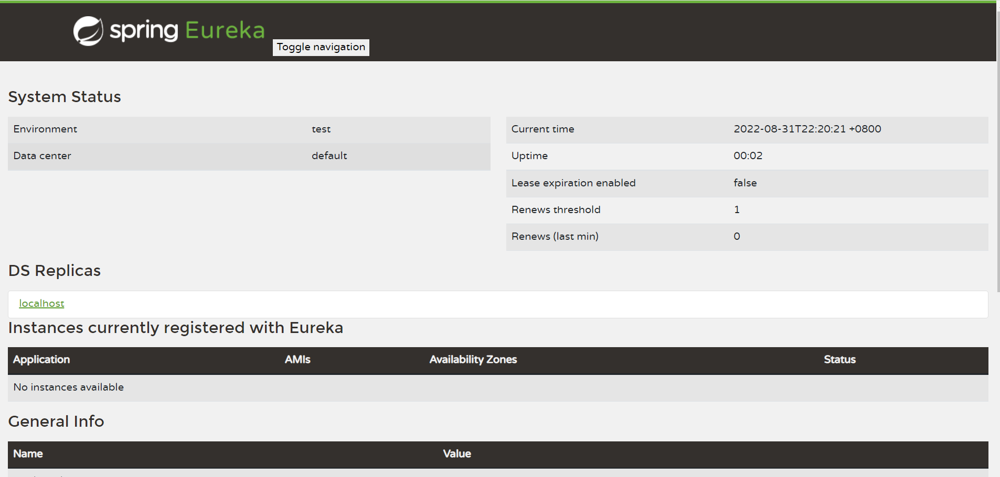
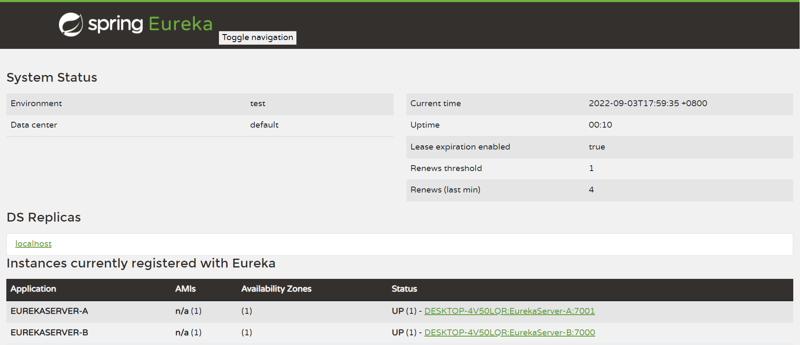
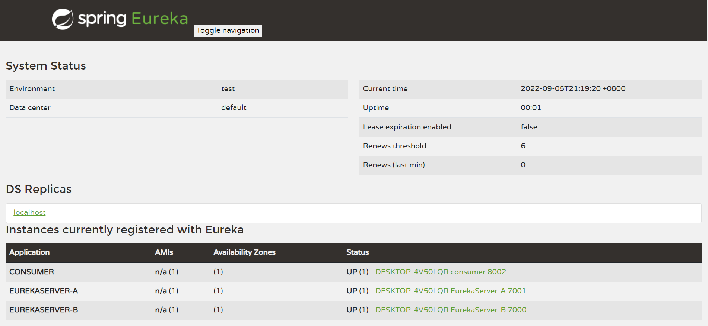

# SpringCloud介绍

## 微服务架构涉及的技术1

1. 服务调用
2. 服务降级
3. 服务注册与发现
4. 服务熔断
5. 负载均衡
6. 消息队列
7. 网关
8. 配置中心
9. 服务监控
10. 全链追踪
11. 服务总线


## SpringCloud组件停更及替换


# 注册中心-Eureka

## Eureka介绍

Eureka采用C-S架构，分为Eureka-server和Eureka-client，并且Eureka-client包含服务提供者和服务消费者两种角色。

* Eureka-client：应用启动后会将信息注册到server。每个一段时间（默认30秒）向server发送发送心跳，证明当前服务可用。
* Eureka-server：提供服务注册服务，各节点启动后会在server注册，server存储所有可用服务节点信息。90秒没收到节点心跳，将节点移除


## 配置文件

```yaml
eureka:
	instance:
		hostname: #主机名，默认为操作系统主机名
		instance-id: #唯一实例ID，不能与其他服务重复
		prefer-ip-address: #是否显示ip地址，为true时，hostname失效
	client: 
	server:
	dashboard:
```

* instance:当前Eureka Instance实例信息配置
* client：客户端信息配置
* server：注册中心信息配置
* dashboard：注册中心仪表盘配置

参考：https://www.cnblogs.com/jpfss/p/11308300.html

## 案例

### Eureka-Server

1. 添加依赖

```xml
<parent>
    <groupId>org.springframework.boot</groupId>
    <artifactId>spring-boot-starter-parent</artifactId>
    <version>2.7.3</version>
    <relativePath/> <!-- lookup parent from repository -->
</parent>
<dependencies>
	<dependency>
		<groupId>org.springframework.cloud</groupId>
		<artifactId>spring-cloud-starter</artifactId>
        <!--3.1.3-->
	</dependency>
    <dependency>
        <groupId>org.springframework.cloud</groupId>
        <artifactId>spring-cloud-starter-netflix-eureka-server</artifactId>
        <!--3.1.3-->
    </dependency>
</dependencies>
```


2. 启动代码添加@EnableEurekaServer注解

```java
@SpringBootApplication
@EnableEurekaServer
public class EurekaServerApplication {
    public static void main(String [] args){
        SpringApplication.run(EurekaServerApplication.class,args);
    }
}
```


3.配置文件

```yaml
server:
  port: 7000

spring:
  application:
    name: EurekaServer

eureka:
  client:
    #注册中心不需要自己注册自己
    #默认true
    register-with-eureka: false
    fetch-registry: false
    service-url:
      defaultZone: http://localhost:${server.port}/eureka/
```

* eureka.client.register-with-eureka: 是否将自己注册到EurekaServer，默认true
* eureka.client.fetch-registry：是否从注册中心拉取注册信息表，默认true
* eureka.client.service-url.defaultZone: EurekaServer的地址，多个用逗号（，）分隔
* spring.application.name的内容会成为该服务的名字注册到EurekaServer


4. 启动后界面

启动后访问http://localhost:7000/



### 集群

单点注册中心若遇到故障，对整个系统而言是毁灭性的，所以为维持其可用行，集群是很好的解决方案。Eureka通过相互注册来实现高可用的部署。

多注册中心配置步骤同上，需要改动的地方在于配置文件：

1. A-Server的配置文件，service-url需指向B-Server：

```yaml
server:
  port: 7001

spring:
  application:
    name: EurekaServer-A

eureka:
  client:
    register-with-eureka: true
    fetch-registry: true
    service-url:
      defaultZone: http://localhost:7000/eureka/
```

2. B-Server的配置文件，service-url需指向A-Server：

```yaml
server:
  port: 7000

spring:
  application:
    name: EurekaServer-B

eureka:
  client:
    register-with-eureka: true
    fetch-registry: true
    service-url:
      defaultZone: http://localhost:7001/eureka/
```



### Eureka-Client

1. 引入依赖

```xml
<dependency>
	<groupId>org.springframework.cloud</groupId>
	<artifactId>spring-cloud-starter-netflix-eureka-client</artifactId>
</dependency>
```

2. 启动代码添加@EnableEurekaClient注解

```java
@SpringBootApplication
@EnableEurekaClient
public class EurekaProviderApplication {
    public static void main(String[] args) {
        SpringApplication.run(EurekaProviderApplication.class, args);
    }
}
```

3. 配置文件

```yaml
spring:
  application:
    name: provider
eureka:
  client:
    register-with-eureka: true
    fetch-registry: true
    service-url:
      defaultZone: http://localhost:7000/eureka/,http://localhost:7001/eureka/
```

4. 启动后



### 服务发现

获取注册中心的注册服务列表

1. 启动代码添加@EnableDiscoveryClient

```java
@SpringBootApplication
@EnableEurekaClient
@EnableDiscoveryClient
public class EurekaProviderBApplication {
    public static void main(String[] args){
        SpringApplication.run(EurekaProviderBApplication.class,args);
    }
}
```

2. 获取注册服务信息表

```java
@Resource
private DiscoveryClient discoveryClient;

```

## 自我保护


# 注册中心-zookeeper

可通过https://downloads.apache.org/zookeeper/ 下载zookeeper，然后安装到服务器上。


## 案例

1. 引入依赖

```xml
<dependency>
	<groupId>org.springframework.cloud</groupId>
	<artifactId>spring-cloud-starter-zookeeper-discovery</artifactId>
</dependency>
```


该依赖的版本需与安装的zookeeper版本一致

若版本不一致，可以将该依赖排除，然后引入对应版本的zookeeper依赖

```xml
<dependency>
    <groupId>org.springframework.cloud</groupId>
    <artifactId>spring-cloud-starter-zookeeper-discovery</artifactId>
    <exclusions>
        <exclusion>
            <groupId>org.apache.zookeeper</groupId>
            <artifactId>zookeeper</artifactId>
        </exclusion>
    </exclusions>
</dependency>
<dependency>
    <groupId>org.apache.zookeeper</groupId>
    <artifactId>zookeeper</artifactId>
    <version>xx.xx.xx</version>
</dependency>
```


2. 启动类注解

```java
@SpringBootApplication
@EnableDiscoveryClient
public class ZKProvider_A_Application
{
    public static void main( String[] args )
    {
        SpringApplication.run(ZKProvider_A_Application.class,args);
    }
}
```

3. 配置文件

```yaml
server:
  port: 8004

spring:
  application:
    name: ZK-provider-A
  cloud:
    zookeeper:
      connect-string: #zk的IP地址
```


# 注册中心-consul
