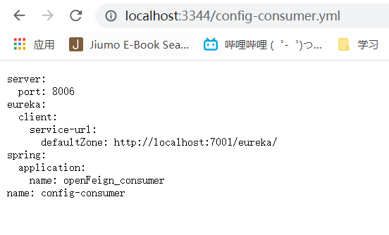
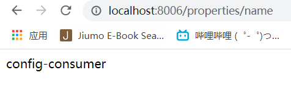
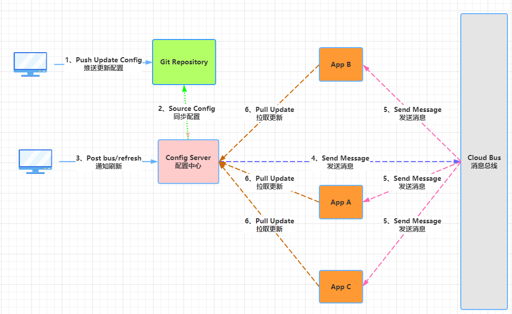
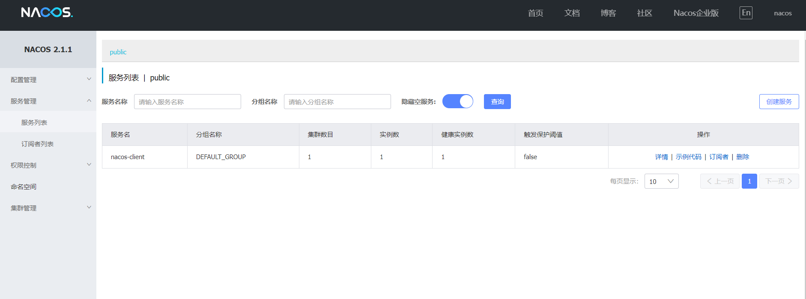
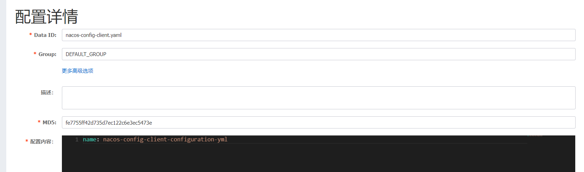
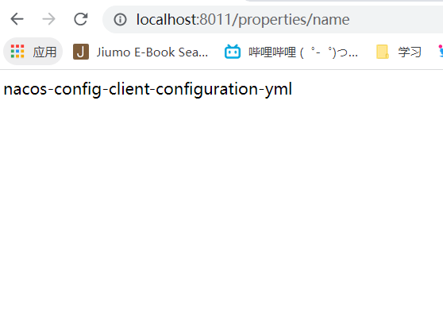

# SpringCloud介绍

## 微服务架构涉及的技术

1. 服务调用
2. 服务降级
3. 服务注册与发现
4. 服务熔断
5. 负载均衡
6. 消息队列
7. 网关
8. 配置中心
9. 服务监控
10. 全链追踪
11. 服务总线


## SpringCloud组件停更及替换


# 注册中心-Eureka

## Eureka介绍

Eureka采用C-S架构，分为Eureka-server和Eureka-client，并且Eureka-client包含服务提供者和服务消费者两种角色。

* Eureka-client：应用启动后会将信息注册到server。每个一段时间（默认30秒）向server发送发送心跳，证明当前服务可用。
* Eureka-server：提供服务注册服务，各节点启动后会在server注册，server存储所有可用服务节点信息。90秒没收到节点心跳，将节点移除


## 配置文件

```yaml
eureka:
	instance:
		hostname: #主机名，默认为操作系统主机名
		instance-id: #唯一实例ID，不能与其他服务重复
		prefer-ip-address: #是否显示ip地址，为true时，hostname失效
	client: 
	server:
	dashboard:
```

* instance:当前Eureka Instance实例信息配置
* client：客户端信息配置
* server：注册中心信息配置
* dashboard：注册中心仪表盘配置

参考：https://www.cnblogs.com/jpfss/p/11308300.html

## 案例

### Eureka-Server

1. 添加依赖

```xml
<parent>
    <groupId>org.springframework.boot</groupId>
    <artifactId>spring-boot-starter-parent</artifactId>
    <version>2.7.3</version>
    <relativePath/> <!-- lookup parent from repository -->
</parent>
<dependencies>
	<dependency>
		<groupId>org.springframework.cloud</groupId>
		<artifactId>spring-cloud-starter</artifactId>
        <!--3.1.3-->
	</dependency>
    <dependency>
        <groupId>org.springframework.cloud</groupId>
        <artifactId>spring-cloud-starter-netflix-eureka-server</artifactId>
        <!--3.1.3-->
    </dependency>
</dependencies>
```


2. 启动代码添加@EnableEurekaServer注解

```java
@SpringBootApplication
@EnableEurekaServer
public class EurekaServerApplication {
    public static void main(String [] args){
        SpringApplication.run(EurekaServerApplication.class,args);
    }
}
```


3.配置文件

```yaml
server:
  port: 7000

spring:
  application:
    name: EurekaServer

eureka:
  client:
    #注册中心不需要自己注册自己
    #默认true
    register-with-eureka: false
    fetch-registry: false
    service-url:
      defaultZone: http://localhost:${server.port}/eureka/
```

* eureka.client.register-with-eureka: 是否将自己注册到EurekaServer，默认true
* eureka.client.fetch-registry：是否从注册中心拉取注册信息表，默认true
* eureka.client.service-url.defaultZone: EurekaServer的地址，多个用逗号（，）分隔
* spring.application.name的内容会成为该服务的名字注册到EurekaServer


4. 启动后界面

启动后访问http://localhost:7000/


### 集群

单点注册中心若遇到故障，对整个系统而言是毁灭性的，所以为维持其可用行，集群是很好的解决方案。Eureka通过相互注册来实现高可用的部署。

多注册中心配置步骤同上，需要改动的地方在于配置文件：

1. A-Server的配置文件，service-url需指向B-Server：

```yaml
server:
  port: 7001

spring:
  application:
    name: EurekaServer-A

eureka:
  client:
    register-with-eureka: true
    fetch-registry: true
    service-url:
      defaultZone: http://localhost:7000/eureka/
```

2. B-Server的配置文件，service-url需指向A-Server：

```yaml
server:
  port: 7000

spring:
  application:
    name: EurekaServer-B

eureka:
  client:
    register-with-eureka: true
    fetch-registry: true
    service-url:
      defaultZone: http://localhost:7001/eureka/
```


### Eureka-Client

1. 引入依赖

```xml
<dependency>
	<groupId>org.springframework.cloud</groupId>
	<artifactId>spring-cloud-starter-netflix-eureka-client</artifactId>
</dependency>
```

2. 启动代码添加@EnableEurekaClient注解

```java
@SpringBootApplication
@EnableEurekaClient
public class EurekaProviderApplication {
    public static void main(String[] args) {
        SpringApplication.run(EurekaProviderApplication.class, args);
    }
}
```

3. 配置文件

```yaml
spring:
  application:
    name: provider
eureka:
  client:
    register-with-eureka: true
    fetch-registry: true
    service-url:
      defaultZone: http://localhost:7000/eureka/,http://localhost:7001/eureka/
```

4. 启动后


### 获取注册服务信息表

获取注册中心的注册服务列表

1. 启动代码添加@EnableDiscoveryClient

```java
@SpringBootApplication
@EnableEurekaClient
@EnableDiscoveryClient
public class EurekaProviderBApplication {
    public static void main(String[] args){
        SpringApplication.run(EurekaProviderBApplication.class,args);
    }
}
```

2. 获取注册服务信息表

```java
@Resource
private DiscoveryClient discoveryClient;

```

## 自我保护模式

当Eureka服务器每分钟收到的心跳数量低于一个阈值时，会触发自我保护模式，不会将服务注册表中的服务实例信息删除。当收到的心跳重新恢复到阈值时，才自动退出自我保护模式。

计算公式：服务实例总数量×（60/每个实例心跳间隔秒数）×自我保护系数（0.85）


# 注册中心-zookeeper

可通过https://downloads.apache.org/zookeeper/ 下载zookeeper，然后安装到服务器上。

## 案例

1. 引入依赖

```xml
<dependency>
	<groupId>org.springframework.cloud</groupId>
	<artifactId>spring-cloud-starter-zookeeper-discovery</artifactId>
</dependency>
```


该依赖的版本需与安装的zookeeper版本一致

若版本不一致，可以将该依赖排除，然后引入对应版本的zookeeper依赖

```xml
<dependency>
    <groupId>org.springframework.cloud</groupId>
    <artifactId>spring-cloud-starter-zookeeper-discovery</artifactId>
    <exclusions>
        <exclusion>
            <groupId>org.apache.zookeeper</groupId>
            <artifactId>zookeeper</artifactId>
        </exclusion>
    </exclusions>
</dependency>
<dependency>
    <groupId>org.apache.zookeeper</groupId>
    <artifactId>zookeeper</artifactId>
    <version>xx.xx.xx</version>
</dependency>
```


2. 启动类注解

```java
@SpringBootApplication
@EnableDiscoveryClient
public class ZKProvider_A_Application
{
    public static void main( String[] args )
    {
        SpringApplication.run(ZKProvider_A_Application.class,args);
    }
}
```

3. 配置文件

```yaml
server:
  port: 8004

spring:
  application:
    name: ZK-provider-A
  cloud:
    zookeeper:
      connect-string: #zk的IP地址
```

## ZK节点

### 节点类型

* 持久性节点：节点创建后一只存在于注册中心，客户端断连/注册中心重启，节点还存在。可以创建子节点，子节点可以临时也可以永久。不可同名
* 临时性节点：客户端失去与Server的连接后，Server会立刻将该节点删除。不能创建子节点，不能同名
* 顺序性节点
  * 持久顺序节点：同名节点会在后面添加序号，其余与持久节点一致
  * 临时顺序节点：同名节点会在后面添加序号，其余与临时节点一致

# 注册中心-consul

## 介绍

HashiGorp公司用go语言开发的一套开源的分布式服务发现和配置管理系统。

提供服务治理、配置中心、控制总线等功能，且每个功能可以单独使用。

下载地址：https://www.consul.io/downloads

## 案例

1. 引入依赖

```xml
<dependency>
    <groupId>org.springframework.cloud</groupId>
    <artifactId>spring-cloud-starter-consul-discovery</artifactId>
</dependency>
```

2. 配置文件

```yaml
server:
  port: 8005

spring:
  application:
    name: Consul-provider-A

  cloud:
    consul:
      host: #consul server host
      port: #consul server port
      discovery:
        service-name: ${spring.application.name}
```

3. 启动类

```java
@SpringBootApplication
@EnableDiscoveryClient
public class ConsulProvider_A_Application {
    public static void main(String[] args){
        SpringApplication.run(ConsulProvider_A_Application.class,args);
    }
}
```

使用到的启动类注解与ZK的注解一致

# Ribbon

## 负载均衡

将访问服务的请求，均衡的分配到每个服务上，避免服务因请求压力过大而崩溃。

负载均衡分为两种：

* 集中式LB()--在服务消费者和服务提供者之间有一个独立的负载均衡系统来承担负载均衡功能
* 进程式LB--将负载均衡功能整合进服务消费端，会从注册中心拉取注册信息表，并缓存到本地。

Ribbon是一个软负载均衡的客户端组件，可以和其他所需请求的客户端结合使用。


Ribbon工作时先从Eureka Server(注册中心)获取服务信息列表，优先选择同一个区域内负载较少的Server；然后根据用户指定的策略，将请求发送给服务提供者。

## Ribbon核心组件IRule及负载均衡策略

IRule接口：根据特定的算法从服务列表中选择一个要访问的服务

|                 实现类                  |                         负载均衡算法                         |
| :-------------------------------------: | :----------------------------------------------------------: |
| com.netflix.loadbalancer.RoundRobinRule |                             轮询                             |
|   com.netflix.loadbalancer.RandomRule   |                             随机                             |
|   com.netflix.loadbalancer.RetryRule    | 先按照RoundRobinRule的策略获取服务，如果获取失败则在指定时间内进行重试，获取可用的服务 |
|        WeightedResponseTimeRule         | 对RoundRobinRule的扩展，响应速度越快的实例选择权重越大，越容易被选中 |
|            BestAvailableRule            | 会先过滤掉由于多次访问故障而处于断路跳闸状态的服务，然后选择一个并发量小的服务 |
|        AvailabilityFilteringRule        |          先过滤掉故障实例，然后再选择并发量小的实例          |
|            ZoneAvoidanceRule            | 默认规则，复合判断server所在区域的性能和server的可用性选择服务器 |

Ribbon默认负载轮询算法：

接口第几次请求数%请求服务的集群数量=实际调用服务的位置下标

# openFeign

## 介绍

openFeign是Spring Cloud对feign的再次封装，使其支持MVC注解和HttpMessageConverts。Spring Cloud 集成了 Eureka、Spring Cloud CircuitBreaker 以及 Spring Cloud LoadBalancer，在使用 Feign 时提供负载均衡的 http 客户端

Feign是声明式Web Service客户端，简化了使用RestTemplate调用服务的步骤，通过接口+注解的方式来调用服务。

## 案例

1.引入依赖

```xml
<dependency>
    <groupId>org.springframework.cloud</groupId>
    <artifactId>spring-cloud-starter-openfeign</artifactId>
</dependency>
```

2.添加启动类注解

```java
@SpringBootApplication
@EnableEurekaClient
@EnableFeignClients
public class OpenFeignApplication {
    public static void main(String[] args){
        SpringApplication.run(OpenFeignApplication.class,args);
    }
}
```

2.创建接口

```java
@Component
@FeignClient(value = "provider")
public interface TestService {
    @GetMapping("/hello/port")
    String getHello();
}
```

@FeignClient的value属性对应服务提供者的application.name

## 进阶


# Hystrix

由于网络或者自身原因，微服务不能保证服务百分百可用。若单个服务出现问题，那调用该服务时会出现延迟甚至调用失败的情况。同时，不断地调用该服务会增加服务器地负担，当负担过重，会导致服务崩溃。

开发者很难避免因某些因素而导致的服务之间依赖调用失败，但是尽可能在调用失败时减少或避免对调用方带来的影响

## 介绍

Hystrix是根据断路器模式而建造的。当某个服务发生故障后，通过断路器的故障监控，向调用方返回一个符合预期的服务降级处理，而不是长时间等待或返回调用方无法处理的异常，避免调用方线程不会被长时间不必要的占用。


对于服务器容错来说就是保护服务消费者。

* 服务降级：当服务不可用或者出现问题时设置一个备选方案，避免长时间等待
* 服务熔断：达到设置的最大服务访问量时，拒绝请求，然后调用服务降级方法返回友好提示
* 服务限流：达到最大服务请求时，拒绝请求。

## 案例

1. 引入依赖

```xml
<dependency>
    <groupId>org.springframework.cloud</groupId>
    <artifactId>spring-cloud-starter-netflix-eureka-client</artifactId>
</dependency>
<dependency>
    <groupId>org.springframework.cloud</groupId>
    <artifactId>spring-cloud-starter-netflix-hystrix</artifactId>
    <version>2.2.10.RELEASE</version>
</dependency>
```

2. 启动类注解

```java
@SpringBootApplication
@EnableEurekaClient
@EnableHystrix
public class ProviderHystrixApplication {
    public static void main(String[] args) {
        SpringApplication.run(ProviderHystrixApplication.class, args);
    }
}
```

@EnableCircuitBreaker已被弃用，可使用@EnableHystrix开启Hystrix

3. 使用@HystrixCommand

```java
@HystrixCommand(
    fallbackMethod = "fallbackMethod",
)
public String useProvider_TimeOut() {
    try {
        TimeUnit.MILLISECONDS.sleep(3000);
    } catch (InterruptedException e) {
        e.printStackTrace();
    }
    return "线程池:  " + Thread.currentThread().getName() + " service time out ";
}

public String fallbackMethod() {
    return "系统繁忙或者运行报错，请稍后再试";
}
```

fallbackMethod参数对应的是服务降级方法的方法名，服务降级方法需与被@HystrixCommand标记的方法有同样的入参。

### 服务熔断

```java
@HystrixCommand(
    fallbackMethod = "breakMethod",
    commandProperties = {
        @HystrixProperty(name = "circuitBreaker.enabled", value = "true"),
        @HystrixProperty(name = "circuitBreaker.requestVolumeThreshold", value = "20"),
        @HystrixProperty(name = "circuitBreaker.sleepWindowInMilliseconds", value = "10000"),
        @HystrixProperty(name = "circuitBreaker.errorThresholdPercentage", value = "60")
    }
)
```

* circuitBreaker.enabled：开启断路器
* circuitBreaker.requestVolumeThreshold： 在最近的时间窗口内，请求数量需达到阈值才会开启断路器。默认为20，10秒内该请求数量需达到20次。
* circuitBreaker.sleepWindowInMilliseconds：时间窗口，默认是最近10秒。
* circuitBreaker.errorThresholdPercentage：错误百分比阈值。默认是50%，当请求总数超过阈值，且有50%的请求出现异常，就会开启断路器
* execution.isolation.thread.timeoutInMilliseconds：请求超时时间

断路器开启或关闭条件：

* 条件1：请求数量达到阈值（默认10秒20个请求）
* 条件2：失败率达到设置的百分比时（默认10秒50%请求失败）
* 两个条件都满足则会打开断路器
* 断路器开启后不会call服务提供方的方法，而是直接调用服务降级方法
* 一段时间后（默认5秒），断路器进入半开状态，会让其中一个请求call到服务提供者。若成功，断路器关闭；失败，继续开启。

### 全局服务降级

```java
@DefaultProperties(defaultFallback = "")
```

使用该注解在controller上，该controller中被@HystrixCommand标记的方法会默认设置defaultFallback参数指向的服务降级方法，若@HystrixCommand注解上设置了fallbackMethod参数，则会优先调用fallbackMethod指向的服务降级函数


# 服务网关-GateWay

基于Spring5构建，能够实现响应式非阻塞式的Api，支持长连接，能够更好的整合Spring体系的产品，依赖SpringBoot-WebFlux，WebFlux框架底层则使用了高性能的Reactor模式通信框架Netty


## 三大核心概念

### 路由（Route）

是构建网关的基本模块，是由ID，目标URL，一系列的断言和过滤器组成，如果断言为true，则匹配该路由

### 断言（Predicate）

开发人员可以匹配HTTP请求中的所有内容，如果请求与断言相匹配则进行路由。

假设转发uri为localhost：8888，gateway服务器uri为localhost:9002

| 规则    | 实例                                                         | 说明                                                         |
| ------- | ------------------------------------------------------------ | ------------------------------------------------------------ |
| Path    | - Path=/gate/，/rule/                                        | 当请求路径为gate、rule开头时，转发到localhost：8888服务器上  |
| Before  | \- Before=2017-01-20T17:42:47.789-07:00[America/Denver]      | 在某个时间（2017-01-20T17:42:47.789-07:00）之前的请求才会被转发到 |
| After   | \- After=2017-01-20T17:42:47.789-07:00[America/Denver]       | 在某个时间之后的请求才会被转发                               |
| Between | \- Between=2017-01-20T17:42:47.789-07:00[America/Denver],2017-01-21T17:42:47.789-07:00[America/Denver] | 在某个时间段之间的才会被转发                                 |
| Cookie  | \- Cookie=username,zzyy                                      | 匹配cookie。cookie中必须有username=zzyy才能访问。其中cookie的值支持正则 |
| Header  | \- Header=X-Request-Id, \d+                                  | 请求头，和cookie用法类似                                     |
| Host    | \- Host=www.hd123.com                                        | 根据host地址匹配                                             |
| Method  | \- Method=GET                                                | 只有GET方法才会匹配转发请求                                  |
| Query   | -Query=token                                                 | 根据参数匹配，请求中需有token参数                            |


### 过滤器(Filter)

指的是spring框架中GatewayFileter的实例，使用过滤器，可以在**请求被路由前或者之后**对请求进行修改.

假设转发uri为localhost：8888，gateway服务器uri为localhost:9002

|      | 实例                                    | 说明                                                         |
| ---- | --------------------------------------- | ------------------------------------------------------------ |
|      | - AddRequestHeader=X-Request-Foo, Bar   | 通过配置name和value可以增加请求的header                      |
|      | - AddRequestParameter=foo, bar          | 通过配置name和value可以增加请求的参数                        |
|      | - AddResponseHeader=X-Response-Foo, Bar | 对匹配的请求，响应返回时会额外添加X-Response-Foo:Bar的header返回 |

GatewayFilter Factories有34个过滤器，详情参考官网：

https://docs.spring.io/spring-cloud-gateway/docs/current/reference/html/#gatewayfilter-factories

Global Filters有9个全局过滤器：

https://docs.spring.io/spring-cloud-gateway/docs/current/reference/html/#global-filters

## 案例

引入依赖

```xml
<dependency>
    <groupId>org.springframework.cloud</groupId>
    <artifactId>spring-cloud-starter-gateway</artifactId>
</dependency>
```

### 路由配置

1. 配置文件配置

```yaml
spring:
  application:
    name: api-gateway
  cloud:
    gateway:
      discovery: #开启从注册中心动态创建路由的功能，利用微服务名进行路由
        locator:
          enabled: true
      routes:
        - id: openFeign_consumer  #路由ID，无规则但要求唯一，建议配合服务名
          uri: http://localhost:8006 
          predicates:  #断言
            - Path=/consumer/hello
```

2. 配置类配置（不推荐）

```java
@Configuration
public class GateWayRoutes {
    @Bean
    public RouteLocator customerRoutes(RouteLocatorBuilder builder){
        RouteLocatorBuilder.Builder routes=builder.routes();
        //lambda表达式
        routes.route(p -> p
                .path("/consumer/providerPort")
                .uri("http://localhost:8006")
        ).build();
        return routes.build();
    }
}
```

### 过滤器

1.配置文件配置

```yaml
spring:
  application:
    name: api-gateway
  cloud:
    gateway:
      discovery:
        locator:
          enabled: true
      routes:
        - id: openFeign_consumer
          uri: http://localhost:8006
          predicates:
            - Path=/consumer/hello
          filters:
            - AddRequestParameter=foo, bar
```

2.配置类配置

```java
@Bean
public RouteLocator customerRoutes(RouteLocatorBuilder builder){
    RouteLocatorBuilder.Builder routes=builder.routes();
    //lambda表达式
    routes.route(p -> p
                 .query("id")
                 .and()
                 .path("/consumer/providerPort")
                 .filters(f->f.addRequestHeader("Foo","test"))
                 .uri("http://localhost:8006")
                ).build();
    return routes.build();
}
```

3.自定义全局过滤器

自定义过滤器需实现org.springframework.cloud.gateway.filter.GlobalFilter类和org.springframework.core.Ordered类

```java
@Component
public class CustomGlobalFilter implements GlobalFilter, Ordered {
    @Override
    public Mono<Void> filter(ServerWebExchange exchange, GatewayFilterChain chain) {
        //ServerWebExchange中
        String id=exchange.getRequest().getQueryParams().getFirst("id");
        if (id==null){
            exchange.getResponse().setStatusCode(HttpStatus.NOT_ACCEPTABLE);
            return exchange.getResponse().setComplete();
        }
        return chain.filter(exchange);
    }

    @Override
    public int getOrder() {
        return 0;
    }
}
```

# 配置中心-config

## 微服务架构下配置文件的问题

1. 配置文件会随着微服务增加而增多，且分布在每个微服务中。当修改一个相同的配置时需一个个去修改
2. 手动配置不同环境下各个微服务的配置文件，比较困难
3. 修改配置文件后需要重新启动服务，对正在运行的服务不友好

## Spring Cloud Config

Spring Cloud Config 分为config server和config client两种角色。

我们需将配置文件放在Git Repository里面，然后config server会从Git Repository（默认Git，也可使用svn、mysql、本地文件系统等）中读取配置文件，config client再从config server中拉取配置文件的内容

注：Spring Cloud Config没有可视化的操作界面，配置修改后也不是实时生效的（config server更新了，client没有更新），需要重启或去刷新。


## 案例

### 配置config-server

1.添加依赖

```xml
<dependency>
    <groupId>org.springframework.cloud</groupId>
    <artifactId>spring-cloud-config-server</artifactId>
</dependency>
```

2.启动类注解

```java
@SpringBootApplication
@EnableConfigServer
public class ConfigServerApplication {
    public static void main(String[] args) {
        SpringApplication.run(ConfigServerApplication.class, args);
    }

}
```

3.配置文件

```yaml
server:
  port: 3344

spring:
  application:
    name: cloud-config-server
  cloud:
    config:
      server:
        git:
          uri: https://gitee.com/cx_link_3679/cloud-config-test.git
          #仓库分支
          default-label: master
          #查找的文件路径，若寻找不到配置文件会到uri中配置的根目录下寻找
          search-paths:
            - cloud-config-consumer
          username: 
          password: 
```



### 配置config-client

1.添加依赖

```xml
<dependency>
    <groupId>org.springframework.cloud</groupId>
    <artifactId>spring-cloud-starter-config</artifactId>
</dependency>
<dependency>
    <groupId>org.springframework.cloud</groupId>
    <artifactId>spring-cloud-starter-bootstrap</artifactId>
</dependency>
```

Spring Cloud 新版本默认将 Bootstrap 禁用，需要将 spring-cloud-starter-bootstrap 依赖引入到工程中。否则会报错org.springframework.cloud.commons.ConfigDataMissingEnvironmentPostProcessor$ImportException: No spring.config.import set

2.启动类注解

无相关注解


3.配置文件

新建bootstrap.yml文件

```yaml
spring:
  application:
    name: cloud-config-consumer
  cloud:
    config:
      uri: http://localhost:3344/
      label: master
```

http 访问 config 配置中心配置文件的 url 形式

* /{application}/{profile}[/{label}]
* /{application}-{profile}.yml
* /{label}/{application}-{profile}.yml
* /{application}-{profile}.properties
* /{label}/{application}-{profile}.properties

其中application指的是项目名称spring.application.name

profile指的是配置文件环境spring.cloud.config.profile

4.测试

controller：

```Java
@RestController
@RequestMapping("properties")
public class NameController {
    @Value("${name}")
    private String name;

    @GetMapping("name")
    public String getName(){
        return name;
    }
}
```




# 消息总线-Bus

Spring Cloud Bus是用来将分布式系统的节点与轻量级消息系统链接起来的框架，它整合了Java的事件处理机制和消息中间件的功能，它能管理和传播分布式系统间的消息，就像一个分布式执行器，可用于广播状态更改、事件推送等，也可以当作微服务间的通信通道，目前支持RabbitMQ和Kafka

使用轻量级的消息代理（RabbitMQ和Kafka）来连接微服务架构中的各个服务，可以将其用于广播状态更改（例如配置中心配置更改）或其他管理指令

Spring Cloud Bus是在Spring Cloud Stream基础之上再次进行抽象封装，使得我们可以在不用理解消息发送、监听等概念的基础上使用消息来完成业务逻辑的处理


## 案例

### 动态刷新全局广播配置。



Bus 结合Config和Actuator。

工作流程：

* 配置更新，推送到`Git`仓库
* `Config Server`配置中心同步配置
* 使用订阅了消息的主机给服务配置中心发送一个`Post bus/refresh`更新请求
* 服务配置中心给消息总线发送通知请求刷新配置
* 消息总线向域内指定或所有服务发送更新通知消息
* 服务从服务配置中心拉取最新配置

基本原理：

`ConfigClient`实例都监听`MQ`中同一个`topic`(默认是`springCloudBus`)。当一个服务刷新数据的时候，它会把这个信息放入到`Topic`中，这样其它监听同一`Topic`的服务就能得到通知，然后去更新自身的配置。

引入依赖：

给config-server添加依赖

```xml
<dependency>
    <groupId>org.springframework.cloud</groupId>
    <artifactId>spring-cloud-starter-bus-amqp</artifactId>
</dependency>
<dependency>
    <groupId>org.springframework.cloud</groupId>
    <artifactId>spring-cloud-starter-actuator</artifactId>
</dependency>
```

配置文件：

添加RabbitMQ配置及暴露刷新配置的Actuator端点：

```yaml

```


### 动态刷新定点通知

只刷新某个server的配置，而不是全部刷新

公式：http://localhost:配置中心的端口号/actuator/bus-refresh/{destination}

destination=服务名:端口号

# Spring Cloud Stream

不同的消息中间件其实现方式不同，内部结构不一样，架构不一样。若我们系统中使用了某个消息中间件，日后若要变更消息中间件，需要改动的地方非常多，因为这个消息中间件已经和我们系统耦合在一起。

Spring Coud Stream则是进行消息中间件与系统耦合。Stream通过抽象封装屏蔽了底层消息队列的差异，提供统一的异步消息通信模型。我们只需要属性Stream定义的消息监听、消息发送模型，就能使用各种中间件。

## 概念

### Source-消息发送通道

用于Spring Cloud Stream与外界通道的绑定，我们可以在该接口中通过注解的方式定义消息通道的名称。当使用该通道接口发送一个消息时，Spring Cloud Stream会将所要发送的消息进行序列化，然后通过该接口所提供的MessageChannel将所要发送的消息发送到相应的消息中间件中。

### Channel-消息通道

消息通道是对消息队列的一种抽象，在向消息中间件发送消息时，需要指定所要发送的消息队列或主题的名称，而在这里Spring Cloud Stream进行了抽象，开发者只需要定义好消息通道，消息通道具体发送到哪个消息队列则在项目配置文件中进行配置，这样一方面可以将具体的消息队列名称与业务代码进行解耦，另外一方面也可以让开发者方便地根据项目环境切换不同的消息队列

### Binder-消息绑定器

通过定义绑定器作为中间层，实现了应用程序与具体消息中间件细节之间的隔离，向应用程序暴露统一的消息通道，使应用程序不需要考虑与各种不同的消息中间件的对接。当需要升级或者更改不同的消息中间件时，应用程序只需要更换对应的绑定器即可，而不需要修改任何应用逻辑。

默认提供了对RabbitMQ和Apache Kafka的绑定器

### Sink-消息监听通道接口

当从消息中间件中接收到一个待处理消息时，该接口将负责把消息数据反序列化为Java对象，然后交由业务所定义的具体业务处理方法进行处理。


# Nacos

Nacos 致力于帮助您发现、配置和管理微服务。Nacos 提供了一组简单易用的特性集，帮助您快速实现动态服务发现、服务配置、服务元数据及流量管理。(来自官网)

特性：

* 服务发现和服务健康监测
* 动态配置服务
* 动态 DNS 服务
* 服务及其元数据管理
* .......

# Nacos注册中心

Nacos注册中心分为server与client，server采用Java编写，为client提供注册发现服务与配置服务。而client可以用多语言实现，client与微服务嵌套在一起，nacos提供sdk和openApi，如果没有sdk也可以根据openApi手动写服务注册与发现和配置拉取的逻辑。

## 案例

1.安装nacos

nacos 直接双击打开的时集群模式，未配置的话会报错（Unable to start embedded Tomcat）

单机模式启动进入cmd:startup.cmd -m standalone

账号密码都是nacos

2.创建client

* 引入依赖

```xml
<dependency>
    <groupId>com.alibaba.cloud</groupId>
    <artifactId>spring-cloud-starter-alibaba-nacos-discovery</artifactId>
</dependency>
<dependency>
    <groupId>org.springframework.boot</groupId>
    <artifactId>spring-boot-starter-actuator</artifactId>
</dependency>
```

* 配置文件

```yaml
server:
  port: 8010
spring:
  application:
    name: nacos-client
  cloud:
    nacos:
      discovery:
        server-addr: localhost:8848  #配置Nacos地址
        group: public

#actuator端口暴露
management:
  endpoints:
    web:
      exposure:
        include: '*'
```

* 启动类

```java
@EnableDiscoveryClient
```



# Nacos配置中心

Nacos 提供用于存储配置和其他元数据的 key/value 存储，为分布式系统中的外部化配置提供服务器端和客户端支持。使用 Spring Cloud Alibaba Nacos Config，可以在 Nacos Server 集中管理Spring Cloud 应用的外部属性配置。

## 概念

* **命名空间（Namespace）**
  * 用于进行租户粒度的配置隔离。不同的命名空间下，可以存在相同的 Group 或 Data ID 的配置
  * 常用场景之一是不同环境的配置的区分隔离，例如开发测试环境和生产环境的资源（如数据库配置、限流阈值、降级开关）隔离等
  * 在没有指定 Namespace 的情况下(spring.cloud.nacos.config.namespace)，默认使用 public 命名空间
  * Namespace 的设计就是用来进行资源隔离的
* **配置组（Group）**
  * 通过一个有意义的字符串（如 ABTest 中的实验组、对照组）对配置集进行分组，从而区分 Data ID 相同的配置集
  * 没有明确指定 `spring.cloud.nacos.config.group` 配置的情况下， 默认使用的是 DEFAULT_GROUP
* **配置ID（Data ID）**
  * 某个配置集的 ID，用于划分系统的配置集
  * Data ID 尽量保障全局唯一
  * 通常使用{spring.application.name}.{file-extension:properties}来绑定项目的配置文件信息
* **配置集**:可理解为一个配置文件

## 案例

1.引入依赖

```xml
<dependency>
    <groupId>com.alibaba.cloud</groupId>
    <artifactId>spring-cloud-starter-alibaba-nacos-config</artifactId>
</dependency>
<dependency>
    <groupId>org.springframework.cloud</groupId>
    <artifactId>spring-cloud-starter-bootstrap</artifactId>
</dependency>
```

2.配置文件

使用nacos作为配置中心时，需要创建一个**bootstrap.yaml**和**application.yaml**两个配置文件，**bootstrap.yaml**的优先级高于**application.yaml**，加载时实现加载**bootstrap.yaml**中的相关配置。

创建bootstrapt.yml配置文件：

注意：

* **必须使用 bootstrap 配置文件来配置Nacos Server 地址**
* **当你使用域名的方式来访问 Nacos 时，`spring.cloud.nacos.config.server-addr` 配置的方式为 `域名:port`。**

```yaml
spring:
  application:
    name: nacos-config-client
  cloud:
    nacos:
      discovery:
        server-addr: localhost:8848 #服务注册中心地址
      config:
        server-addr: localhost:8848 #配置中心地址
        file-extension: yaml #指定yaml格式的配置，同时也是dataId的后缀
        group: DEV_GROUP
        namespace: 912eccb8-4d1d-43a0-80c5-0dc6ca5805f6
        refresh:
          enabled: true #是否开启动态刷新
```

nacos新增配置：



注：若区分不同环境，可使用dataId为{spring.application.name}-{profile}.{file-extension:properties}的基础配置。{spring.profiles.active} 当通过配置文件来指定时必须放在 bootstrap.properties 文件中




# Sentinel

Sentinel以流量为切入点，从流量控制、流量路由、熔断降级、系统自适应过载保护、热点流量防护等多个维度保护服务的稳定性。

主要特性：


Sentinel 分为两个部分:

- 核心库（Java 客户端）不依赖任何框架/库，能够运行于所有 Java 运行时环境，同时对 Dubbo / Spring Cloud 等框架也有较好的支持。
- 控制台（Dashboard）基于 Spring Boot 开发，打包后可以直接运行，不需要额外的 Tomcat 等应用容器。

## 安装sentinel控制台

下载页面：https://github.com/alibaba/Sentinel/releases

启动命令：

```
java -Dserver.port=8080 -Dcsp.sentinel.dashboard.server=localhost:8080 -Dproject.name=sentinel-dashboard -jar sentinel-dashboard.jar
```

其中 `-Dserver.port=8080` 用于指定 Sentinel 控制台端口为 `8080`。

账号密码都是sentinel

 

参考wiki：https://github.com/alibaba/Sentinel/wiki/

## 流控规则

重要模式：

| Field           | 说明                                                         | 默认值                        |
| --------------- | ------------------------------------------------------------ | ----------------------------- |
| resource        | 资源名，资源名是限流规则的作用对象                           |                               |
| count           | 限流阈值                                                     |                               |
| grade           | 限流阈值类型，QPS 模式（1）或并发线程数模式（0）             | QPS 模式                      |
| limitApp        | 流控针对的调用来源                                           | `default`，代表不区分调用来源 |
| strategy        | 调用关系限流策略：直接、链路、关联                           | 根据资源本身（直接）          |
| controlBehavior | 流控效果（直接拒绝/WarmUp/匀速+排队等待），不支持按调用关系限流 | 直接拒绝                      |
| clusterMode     | 是否集群限流                                                 | 否                            |

### 流控模式

* 直接：当QPS超过阈值进行限流
* 关联：当
* 链路：指定调用链路上的流量达到阈值就限流

### 阈值类型

1. **QPS**-每秒请求数量，有以下三个流控效果

   * 快速失败

   * Warm up--预热/冷启动方式

   * 排队等待--控制请求通过的间隔时间，也即是让请求以均匀的速度通过，对应的是漏桶算法。

2. 线程数
   * 无流控效果，只有流控模式
   * 当调用该api的线程数量达到阈值，就开始限流


## 熔断降级规则

重要属性：

|                    |                                                              |            |
| ------------------ | ------------------------------------------------------------ | ---------- |
| Field              | 说明                                                         | 默认值     |
| resource           | 资源名，即规则的作用对象                                     |            |
| grade              | 熔断策略，支持慢调用比例/异常比例/异常数策略                 | 慢调用比例 |
| count              | 慢调用比例模式下为慢调用临界 RT（超出该值计为慢调用）；异常比例/异常数模式下为对应的阈值 |            |
| timeWindow         | 熔断时长，单位为 s                                           |            |
| minRequestAmount   | 熔断触发的最小请求数，请求数小于该值时即使异常比率超出阈值也不会熔断（1.7.0 引入） | 5          |
| statIntervalMs     | 统计时长（单位为 ms），如 60*1000 代表分钟级（1.8.0 引入）   | 1000 ms    |
| slowRatioThreshold | 慢调用比例阈值，仅慢调用比例模式有效（1.8.0 引入）           |            |

### 熔断策略-慢调用比例

 `SLOW_REQUEST_RATIO`：需要设置允许的慢调用 RT（即最大的响应时间），请求的响应时间大于该值则统计为慢调用。当单位统计时长（`statIntervalMs`）内请求数目大于设置的最小请求数目，并且慢调用的比例大于阈值，则接下来的熔断时长内请求会自动被熔断。经过熔断时长后熔断器会进入探测恢复状态（HALF-OPEN 状态），若接下来的一个请求响应时间小于设置的慢调用 RT 则结束熔断，若大于设置的慢调用 RT 则会再次被熔断。


### 熔断策略-异常比例

 `ERROR_RATIO`：当单位统计时长（`statIntervalMs`）内请求数目大于设置的最小请求数目，并且异常的比例大于阈值，则接下来的熔断时长内请求会自动被熔断。经过熔断时长后熔断器会进入探测恢复状态（HALF-OPEN 状态），若接下来的一个请求成功完成（没有错误）则结束熔断，否则会再次被熔断。异常比率的阈值范围是 `[0.0, 1.0]`，代表 0% - 100%


### 熔断策略-异常数

 `ERROR_COUNT`：当单位统计时长内的异常数目超过阈值之后会自动进行熔断。经过熔断时长后熔断器会进入探测恢复状态（HALF-OPEN 状态），若接下来的一个请求成功完成（没有错误）则结束熔断，否则会再次被熔断。


注意：注意异常降级**仅针对业务异常**，对 Sentinel 限流降级本身的异常（`BlockException`）不生效。为了统计异常比例或异常数，需要通过 `Tracer.trace(ex)` 记录业务异常。


## 热点规则

热点参数限流，用于限制经常访问的数据，如限制访问频率最高的Top K 的数据。

热点参数限流会统计传入参数中的热点参数，并根据配置的限流阈值与模式，对包含热点参数的资源调用进行限流。热点参数限流可以看做是一种特殊的流量控制，仅对包含热点参数的资源调用生效。

注意：参数必须是基本类型或String

## 系统规则

系统保护规则是应用整体维度的，而不是资源维度的，并且**仅对入口流量生效**。入口流量指的是进入应用的流量（`EntryType.IN`），比如 Web 服务或 Dubbo 服务端接收的请求，都属于入口流量。

### 阈值类型

* Load自适应（仅对 Linux/Unix-like 机器生效）：系统的 load1 作为启发指标，进行自适应系统保护。当系统 load1 超过设定的启发值，且系统当前的并发线程数超过估算的系统容量时才会触发系统保护（BBR 阶段）。系统容量由系统的 `maxQps * minRt` 估算得出。设定参考值一般是 `CPU cores * 2.5`。
* CPU usage：当系统 CPU 使用率超过阈值即触发系统保护（取值范围 0.0-1.0），比较灵敏
* 平均RT：当单台机器上所有入口流量的平均 RT 达到阈值即触发系统保护，单位是毫秒。
* 并发线程数：当单台机器上所有入口流量的并发线程数达到阈值即触发系统保护。
* 入口QPS：当单台机器上所有入口流量的 QPS 达到阈值即触发系统保护。


# Seata

Seata 是一款开源的分布式事务处理框架，Seata是由阿里开源，前身为Fescar，经过品牌升级变身Seata。

Seata 为用户提供了 AT、TCC、SAGA 和 XA 事务模式

官网文档：https://seata.io/zh-cn/docs/overview/what-is-seata.html

## 背景

当单体架构无法满足不断增长的请求时，会将业务拆分整理微服务架构，同时将数据库分库分表，每个业务维护自己的数据库。

这时用户发来请求，该请求涉及到多个微服务，但此时只能保证自己本地的数据一致性，无法确保其他服务是否操作成功，而为了确保该操作流程的数据一致性，则需要分布式事务。

## 分布式事务解决方案

https://blog.csdn.net/weixin_70730532/article/details/125029945

分布式事务在分布式环境下，为了满足可用性、性能与降级服务的需要，降低一致性与隔离性的要求，一方面遵循 BASE 理论：

* 基本业务可用性（Basic Availability）
* 柔性状态（Soft state）
* 最终一致性（Eventual consistency）

同时也部分遵循ACID规范：

* 原子性：严格遵循
* 一致性：事务完成后的一致性严格遵循；事务中的一致性可适当放宽
* 隔离性：并行事务间不可影响；事务中间结果可见性允许安全放宽
* 持久性：严格遵循

实现分布式事务的方案：

* 基于 `XA` 协议（两段式提交）的 `2PC`、`3PC`
* 基于业务层的 `TCC`
* 本地消息表
* 消息队列 + 消息表实现的最终一致性方案
* Saga

* .....

## Seata分布式事务的角色

- `Transaction Coordinator(TC)`: 全局事务协调者，用来协调全局事务和各个分支事务（不同服务）的状态， 驱动全局事务和各个分支事务的回滚或提交。
- `Transaction Manager(TM)`: 事务管理者，定义全局事务的范围。业务层中用来开启/提交/回滚一个整体事务（在调用服务的方法中用注解开启事务）。
- `Resource Manager(RM)`: 资源管理者，一般指业务数据库代表了一个分支事务（`Branch Transaction`），管理分支事务与 `TC` 进行协调注册分支事务并且汇报分支事务的状态，驱动分支事务的提交或回滚。

## Seata整体工作流程

1. TM 向 TC 申请开启一个全局事务，全局事务创建成功后，TC 会针对这个全局事务生成一个全局唯一的 XID；
2. XID 通过服务的调用链传递到其他服务;
3. RM 向 TC 注册一个分支事务，并将其纳入 XID 对应全局事务的管辖；
4. TM 根据 TC 收集的各个分支事务的执行结果，向 TC 发起全局事务提交或回滚决议；
5. TC 调度 XID 下管辖的所有分支事务完成提交或回滚操作。

## Seata AT 事务模式

AT模式是Seata默认的工作模式。需要基于支持本地 ACID 事务的关系型数据库，Java 应用，通过 JDBC 访问数据库。

该模式是XA协议的演变（未了解XA协议）

需要针对业务中涉及的各个数据库表（？），分别创建一个UNDO_LOG表。

### 整体流程机制

一阶段：

* Seata首先会拦截“业务SQL“,解析SQL语义,获取SQL的基本信息操作类型（UPDATE/insert）、表名、判断条件（）等相关信息
* 根据SQL的信息，生成查询语句找到要更新的业务数据，将数据保存为 前镜像数据beforeImage
* 然后执行”业务SQL“更新数据，
* 更新之后再次保存新数据快照 后镜像数据afterimage
* 插入回滚日志：将前后镜像数据和业务SQL的信息组成一条回滚日志记录，插入到UNDO_LOG表
* 注册分支事务，生成行锁：在本次业务操作的本地事务提交前，RM会向TC注册分支事务，并对该业务诗句的记录生成行锁
* 这些操作都在本地数据库事务内完成，这样保证了一阶段的原子性。
* 本地事务提交：将业务数据的更新和前面生成的UNDO_LOG一并提交
* 上报执行结果：将本地事务提交的结果上报给TC


二阶段：提交

当所有的 RM 都将自己分支事务的提交结果上报给 TC 后，TM 根据 TC 收集的各个分支事务的执行结果，来决定向 TC 发起全局事务的提交或回滚。

若所有分支事务都执行成功，TM 向 TC 发起全局事务的提交，并批量删除各个 RM 保存的 UNDO_LOG 记录和行锁；否则全局事务回滚。

二阶段：回滚

若全局事务中的任何一个分支事务失败，则 TM 向 TC 发起全局事务的回滚，并开启一个本地事务，执行如下操作。

1. 查找 UNDO_LOG 记录：通过 XID 和分支事务 ID（Branch ID） 查找所有的 UNDO_LOG 记录。

2. 数据校验：将 UNDO_LOG 中的后镜像数据（afterImage）与当前数据进行比较，如果有不同，则说明数据被当前全局事务之外的动作所修改，需要人工对这些数据进行处理。

3. 生成回滚语句：根据 UNDO_LOG 中的前镜像（beforeImage）和业务 SQL 的相关信息生成回滚语句：

4. 还原数据：执行回滚语句，并将前镜像数据、后镜像数据以及行锁删除。

5. 提交事务：提交本地事务，并把本地事务的执行结果（即分支事务回滚的结果）上报给 TC。
